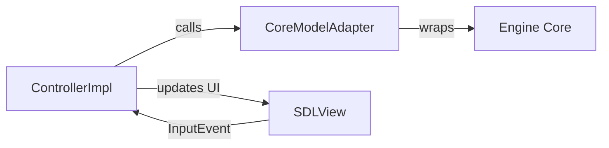

# Gambit Chess Engine Handbook

Gambit is a GUI-only chess application written in C++ and organized around an MVC architecture.  
This repository is intended to be distributed as a ready-to-run Windows package.

---

## Overview

Gambit provides a classic desktop chess experience with:
- Board view
- Move history
- Captured-piece tracking
- Timers
- Promotion handling

The application is structured as:

- **Model** → chess state and rules  
- **View** → SDL rendering and input  
- **Controller** → game flow and logic  

---

## How to Run

1. Extract the ZIP file
2. Open the `MVC/` folder
3. Double-click `gambit.exe`

No compilation required.

---

## Controls

### Mouse
- Left click → select piece
- Left click destination → move

### Keyboard
- `N` → New game  
- `M` → Toggle PvP / PvE  
- `H` → Help  
- `Esc` / `Q` → Quit  
- Arrow keys → Scroll history  

---

## Game Modes

- Default: Player vs Player  
- Press `M` → Player vs Engine  

---

## Project Structure

| Path | Purpose |
|------|--------|
| `MVC/src/main/` | Entry point |
| `MVC/src/mvc/` | MVC implementation |
| `MVC/src/core/` | Chess logic |
| `MVC/src/engine/` | AI engine |
| `MVC/src/ui/sdl/` | SDL UI |
| `MVC/lib/` | Runtime DLLs |

---

## MVC Flow

1. Input received (mouse/keyboard)
2. View converts to event
3. Controller processes event
4. Model updates state
5. View renders changes

---

## Build Instructions

### Windows
```bash
mingw32-make all
```

### Linux
```bash
make all
```

---

# MVC Migration Report

## Executive Summary

- Project refactored into strict **MVC architecture**
- Controller now handles all game flow logic
- View handles rendering only
- Model owns game rules and state

---

## Objectives

- Enforce clean architecture separation  
- Centralize logic in controller  
- Keep UI independent  
- Maintain protocol support (UCI, XBoard)  

---

## Architecture Overview

### Model (`IModel`)
- Owns chess state  
- Implemented by `CoreModelAdapter`

### View (`IView`)
- Handles rendering/input  
- Implemented by `SDLView`  

### Controller (`IController`)
- Handles logic  
- Implemented by `ControllerImpl`

---

## MVC Interaction Diagram


