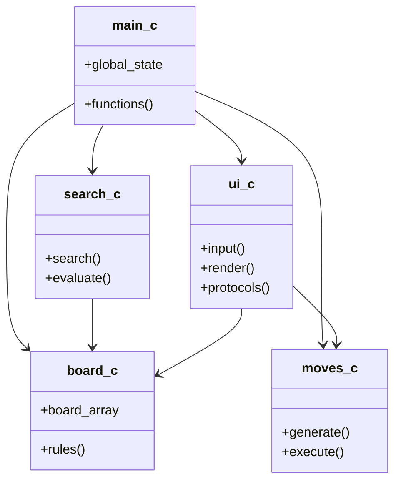
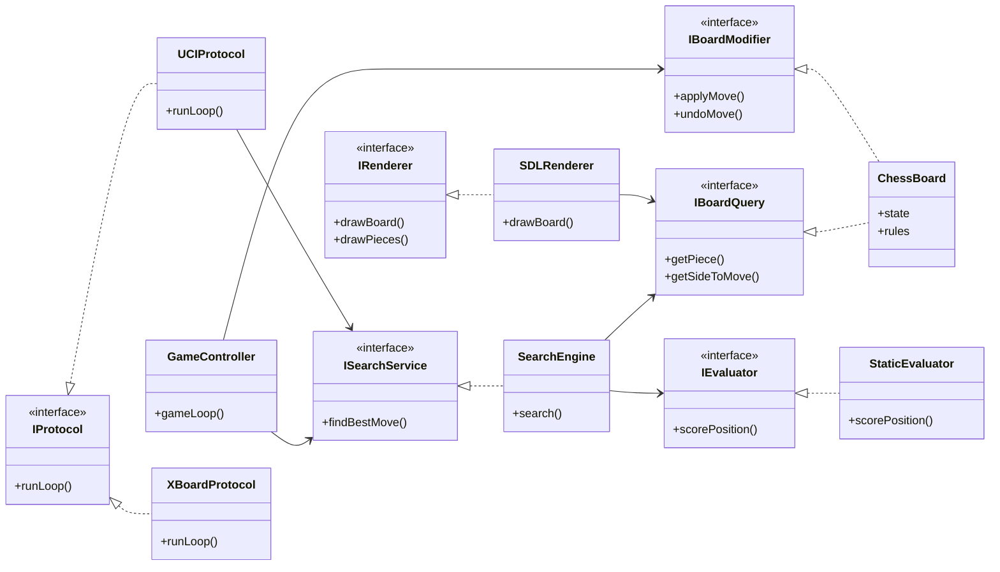
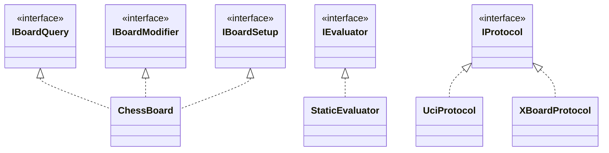
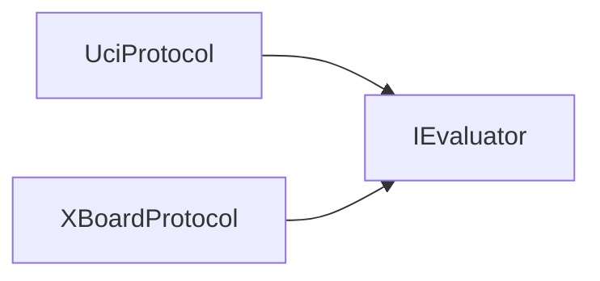

# 0714-02-CSE-2100
Course Code: 0714 02 CSE 2100 || Course Title : Advanced Programming Laboratory
 || ID : 240204 , 240215
 
# Gambit Chess Engine: C to C++ Transition with OOD and SOLID Implementation

**Course:** Advanced Programming Lab (2nd Year CSE)  
**Project:** Gambit Chess Engine   

## Folder Structure (Key Areas)

```
SOLID/
	src/
		core/
			attack/
			bitboards/
			board/
			moves/
			types/
		engine/
			evaluation/
			hashtable/
			search/
		main/
		openingbook/
		ui/
			protocols/
			sdl/
				controller/
				input/
				platform/
				services/
				state/
		utils/
	build/
	docs/
	lib/
	scripts/
```


## Executive Overview

This report presents a structured transition plan from legacy C-style implementation to modern C++ architecture for the Gambit Chess Engine, with explicit focus on:

1. Object-Oriented Design (OOD)
2. SOLID principles implementation
3. Incremental migration without gameplay regression
4. Maintainability, testability, and extensibility

The goal is not only to modernize syntax, but to redesign responsibility boundaries so the engine remains correct, scalable, and easier to evolve.

---

## Why Transition from C to C++

The transition is justified by both engineering and academic value.

### Engineering motivations

1. Better encapsulation and state safety through classes and access control.
2. Cleaner module boundaries using interfaces and polymorphism.
3. Reduced memory risk via RAII (`std::vector`, `std::unique_ptr`, `std::array`).
4. Easier feature extension (new evaluators, renderers, protocols, time controls).
5. Better testability through dependency injection and interface contracts.

### Academic motivations

1. Demonstrates practical application of OOD in systems-level software.
2. Demonstrates applied SOLID in a non-trivial domain (chess engine).
3. Demonstrates design pattern usage under performance constraints.

---

## Transition Objectives

### Primary objectives

1. Preserve chess correctness and protocol behavior.
2. Replace broad shared state with cohesive domain classes.
3. Introduce clear abstraction layers:
- UI and protocols
- Engine services
- Core chess domain
4. Implement all five SOLID principles in concrete code structure.

### Non-objectives

1. No risky big-bang rewrite.
2. No immediate algorithmic redesign of search/evaluation logic.
3. No behavior-breaking API removal before compatibility layer.

---

## Target OOD Architecture

### Layered model

1. **Presentation Layer**
- SDL GUI
- UCI protocol
- XBoard protocol

2. **Application/Service Layer**
- Search service
- Evaluation service
- Game controller/service orchestration

3. **Domain Layer**
- Board state and rules
- Move generation and execution
- Attack and validation logic

4. **Infrastructure Layer**
- Hash table
- Opening book IO
- Timer, logging, utility services

### Dependency rule

Dependencies flow downward only:

`Presentation -> Services -> Domain -> Infrastructure`

No domain module depends on presentation concerns.

### UML Diagrams (C to C++ Transition with SOLID)

The diagrams below show the shift from a C-style, flat design to a C++ design with clear responsibilities and SOLID boundaries.

#### Diagram 1: Before (C-style, procedural)



#### Diagram 2: After (C++ OOD with SOLID boundaries)



#### Diagram 3: SOLID flow (layered dependencies)

```mermaid
flowchart LR
	P(Presentation Layer)
    [SDL GUI, UCI, XBoard]
        |
        v 
    S(Service Layer)
    [GameController, SearchService]
        |
        v
    D(Domain Layer)
    [Board, Moves, Rules]
        |
        v
    I(Infrastructure)
    [Hash, Opening Book, Utils]

	P -. depends on interfaces .-> S
	S -. depends on interfaces .-> D
```

These diagrams highlight:
1. The old C-style design mixed many jobs in the same place.
2. The new C++ design splits responsibilities and uses interfaces (SRP, ISP, DIP).
3. New features can be added without changing stable core classes (OCP).

---

## Core Class and Interface Design

### Key classes (concrete)

1. `ChessBoard`
2. `SearchEngine`
3. `StaticEvaluator`
4. `HashTable`
5. `OpeningBook`
6. `GameController`

### Key interfaces (contracts)

1. `IBoardQuery` (read-only board state)
2. `IBoardModifier` (state mutation operations)
3. `IBoardSetup` (initialization/reset/FEN setup)
4. `IEvaluator` (position scoring)
5. `ISearchService` (best-move search contract)
6. `IProtocol` (UCI/XBoard loop abstraction)
7. `IRenderer` (UI backend abstraction)

This split is designed to enforce both ISP and DIP.

---

## SOLID Implementation Plan

## S: Single Responsibility Principle (SRP)

### Problem pattern
Large files and large state objects mixing unrelated concerns.

### Implementation
1. Separate GUI responsibilities:
- rendering
- input handling
- timer management
- move history tracking
- game flow control

2. Separate board state concerns from search/session concerns.

3. Separate protocol parsing from engine execution service.

### Expected result
Each class has one clear reason to change.

## O: Open/Closed Principle (OCP)

### Implementation
1. Use interface-driven extension points for:
- evaluator strategies
- search strategies
- renderer backends
- protocol handlers

2. Add new behavior by creating new classes implementing interfaces, not modifying stable core classes.

### Expected result
New features are added with minimal risk to existing modules.

## L: Liskov Substitution Principle (LSP)

### Implementation
1. Define strict behavioral contracts for every interface.
2. Ensure all implementations are substitutable (same preconditions/postconditions).
3. Add interface-level test suites reused by all implementations.

### Expected result
Any evaluator/search/protocol implementation can be swapped safely.

## I: Interface Segregation Principle (ISP)

### Implementation
1. Split broad board API into small role-based interfaces:
- query-only
- mutation-only
- setup-only

2. Make modules depend only on the methods they actually need.

### Expected result
Reduced coupling and smaller compile-time dependency surface.

## D: Dependency Inversion Principle (DIP)

### Implementation
1. High-level modules depend on abstractions (`IEvaluator`, `ISearchService`, `IBoardQuery`).
2. Concrete implementations are injected via constructor or factory wiring.
3. Remove direct calls from UI/protocol code into concrete low-level internals.

### Expected result
Architecture becomes testable, replaceable, and stable under change.

---

## Design Patterns Used

1. **Strategy Pattern**
- interchangeable evaluators and search policies

2. **Factory Pattern**
- centralized creation of board/service/protocol objects

3. **Facade Pattern**
- simplified API for game loop orchestration

4. **Command Pattern** (optional expansion)
- move command history for structured undo/redo

5. **Observer Pattern** (optional expansion)
- notifications for game events (check, mate, draw, timeout)

---

## Migration Roadmap (Phased)

## Phase 1: Baseline and Safety Net

1. Freeze functional baseline.
2. Add perft snapshots and protocol smoke checks.
3. Add build checks for target modules.

**Deliverable:** deterministic baseline report.

## Phase 2: Type Modernization

1. Convert key macros/constants to `constexpr` and `enum class` where safe.
2. Introduce typed wrappers for move/board primitives.

**Deliverable:** modernized type layer with no behavior change.

## Phase 3: Interface Introduction

1. Add `IBoardQuery`, `IBoardModifier`, `IBoardSetup`, `IEvaluator`, `ISearchService`.
2. Keep adapter layer for compatibility.

**Deliverable:** compile-safe abstraction layer.

## Phase 4: Core Refactor

1. Migrate core modules from direct concrete access to interface calls.
2. Encapsulate mutable board internals behind methods.

**Deliverable:** reduced direct field coupling.

## Phase 5: Service and UI Decoupling

1. Route protocol and GUI flows through service interfaces.
2. Remove protocol/UI direct dependency on core internals.

**Deliverable:** clean Presentation -> Service boundaries.

## Phase 6: Hardening and Cleanup

1. Apply RAII ownership cleanup.
2. Remove dead compatibility paths.
3. Final static analysis and review.

**Deliverable:** production-ready OOD/SOLID architecture.

---

## Risk Management

### Key risks

1. Functional regression in move legality or search behavior.
2. Hidden dependency breakage during encapsulation.
3. Performance regression from abstraction overhead.

### Mitigations

1. Compile-and-test after every small patch batch.
2. Perft regression gates at fixed depths.
3. Protocol golden-output checks for UCI/XBoard.
4. Nodes-per-second benchmark comparison before/after each phase.
5. Compatibility layer during transition window.

---

## Validation and Quality Gates

Transition is accepted only if all checks pass:

1. Core compile gates pass.
2. Perft baselines match expected values.
3. UCI and XBoard smoke tests pass.
4. GUI basic interaction works (if environment dependencies exist).
5. No new critical static-analysis findings.
6. Performance regression remains under accepted threshold.

---

## **AI Prompt Set for Execution**


## Prompt 1 - Migration Inventory
"Find the files that still look like old C code. For each one, say how to update it to C++ in simple words. Also tell us which ones are safe to start with first."


| File | C-style issue | C++ fix | Risk |
|---|---|---|---|
| src/core/types/types_definitions.h | macros and globals in header | move constants to `constexpr`/`enum class`, wrap globals in a namespace or service | Medium |
| src/core/moves/moves_generation.cpp | macro-heavy free functions | convert macros to inline helpers and move logic into a `MoveGenerator` class | Medium |
| src/core/board/board_representation.cpp | C-style free functions and stdio | move helpers into `ChessBoard`/`ValidationService`, use <cstdio> and methods | Medium |
| src/utils/utils_init.cpp | global tables | wrap in `EngineBootstrapService` static members | Low |

## Prompt 2 - Baseline Lock
"Before changing anything, make a baseline. Include build checks, perft tests, and quick UCI/XBoard tests with expected results. This helps us prove nothing broke later."


| Check | Expected |
|---|---|
| Build | build/bin/gambit.exe created |
| Perft (depth 3) | matches recorded baseline |
| UCI smoke | engine responds to `uci`/`isready` |
| XBoard smoke | engine accepts xboard/level/go |

## Prompt 3 - Interface Scaffold
"Add core interfaces (IBoardQuery, IBoardModifier, IBoardSetup, IEvaluator, ISearchService). Keep adapters so old code still runs while we move step by step. Do not change behavior."




## Prompt 4 - Encapsulation Pass
"Replace direct board field access with getters and setters. After each safe batch, make fields private. Compile after every batch."


```cpp
// After (current style in ChessBoard)
class ChessBoard {
public:
	int getSide() const { return side; }
	void setSide(int value) { side = value; }
private:
	int side;
};
```

## Prompt 5 - SRP Decomposition
"Find the three biggest files that do too many jobs. Split them into smaller parts so each one does only one job. Keep behavior the same."


| Old file | New files | Responsibility |
|---|---|---|
| src/ui/sdl/sdl_gui.cpp | src/ui/sdl/input/gui_input_handler.cpp | input handling |
| src/ui/sdl/sdl_gui.cpp | src/ui/sdl/state/game_timer.cpp | timer logic |
| src/ui/sdl/sdl_gui.cpp | src/ui/sdl/state/move_history_tracker.cpp | move history |
| src/ui/sdl/sdl_gui.cpp | src/ui/sdl/services/promotion_service.cpp | promotion logic |

## Prompt 6 - DIP Enforcement
"Refactor protocol and GUI code to use interfaces, not concrete engine classes. Remove direct calls to specific evaluators and search code. This makes testing easier."




## Prompt 7 - RAII and Ownership
"Replace manual memory handling with RAII. Use standard containers and smart pointers where needed. Keep lifetimes the same."


```cpp
// RAII in HashTable
class HashTable {
	std::vector<HashEntry> table_;
public:
	HashTable() = default;
	~HashTable() = default;
};
```

## Prompt 8 - Regression Gate
"After each refactor batch, run build checks, perft, and protocol tests. Compare with the baseline and show pass/fail. If anything changed, point to where."


| Test | Must match |
|---|---|
| Build | same output binary and no new warnings |
| Perft (depth 3) | node counts and totals |
| UCI smoke | identical ready/uciok responses |

## Prompt 9 - Performance Gate
"Measure engine speed before and after refactoring using the same settings. Flag any slowdown above the limit and say where it happens."


| Metric | Target |
|---|---|
| Nodes per second | after >= before |

## Prompt 10 - Final SOLID Audit
"Do a final SOLID check. List issues by severity and explain them in simple words. For each issue, suggest a practical fix."


| Severity | Issue | Fix |
|---|---|---|
| High | Large header with macros and globals in types_definitions.h | move to `constexpr` and encapsulated services |
| Medium | C-style move generator with macros in moves_generation.cpp | refactor into a `MoveGenerator` class |
| Low | Global tables in utils_init.cpp | wrap as static members in `EngineBootstrapService` |


## Conclusion

This transition plan defines a structured path from legacy procedural code to modern object-oriented C++ architecture using SOLID principles.

The final result is expected to be:

- Maintainable
- Extensible
- Testable
- Academically demonstrative
- Engineering-grade reliable

This architecture supports long-term evolution while preserving functional correctness throughout the migration process.
