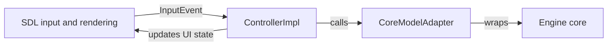

# Gambit Chess Engine Handbook

Gambit is a C++ chess application organized around a strict Model-View-Controller architecture. The repository is intended to be distributed as a ready-to-run Windows package, so the shipped experience is simple: extract the archive, open the `MVC/` folder, and launch the game without compiling anything first.

## Course Context

This project was developed for **Advanced Programming Laboratory**.

| Field | Value |
| --- | --- |
| Course Code | 0714 02 CSE 2100 |
| Course Title | Advanced Programming Laboratory |
| Project | Gambit Chess Engine |
| Team IDs | 240204, 240215 |

## What Gambit Does

Gambit provides a classic desktop chess experience with a board view, move history, captured-piece tracking, timers, promotion handling, and a controller-driven game loop. The GUI release is the primary customer-facing runtime, while the source tree preserves the protocol and engine structure needed for maintenance, testing, and future expansion.

The application is split into three responsibilities:

- Model: chess state, rules, move execution, and validation.
- View: SDL-based rendering and input translation.
- Controller: game flow, selection handling, move application, and promotion decisions.

## Highlights

- Ready-to-run Windows package with bundled runtime DLLs.
- Clean MVC separation with a toolkit-agnostic model interface.
- SDL-backed board rendering and mouse/keyboard input handling.
- Move history, captured pieces, promotion flow, and timers.
- Player vs Player and Player vs Engine gameplay modes.
- Buildable source tree for maintainers and lab submissions.

## First Launch

If you downloaded the repository ZIP from GitHub, extract it fully and open the project folder that contains the executable and the `lib/` directory. In this repository, that folder is `MVC/`.

1. Keep `gambit.exe` and the bundled `lib/` directory together.
2. Double-click `gambit.exe`.
3. Wait for the chess window to appear.
4. Start playing by clicking one piece and then its destination square.

If the executable is moved away from its bundled DLLs, SDL may not load correctly.

## Controls

### Mouse

- Left click a piece to select it.
- Left click a destination square to move the selected piece.

### Keyboard

- `N` - Start a new game.
- `M` - Toggle Player vs Player and Player vs Engine mode.
- `H` - Show in-app help text.
- `Esc` or `Q` - Quit the application.
- `Arrow Up` / `Arrow Down` - Scroll through move history.

### Promotion

When a pawn reaches the final rank, the promotion flow opens automatically. The controller handles the promotion choice and applies the final move through the model.

## Game Modes

The game starts in Player vs Player mode by default. Press `M` to switch to Player vs Engine.

In Player vs Engine mode, the built-in move policy picks the engine response after your move.

## Architecture

Gambit is designed so each layer has one clear job.

### Model

- Owns chess state and rules.
- Implemented by `CoreModelAdapter`.
- Exposes a toolkit-agnostic interface to the rest of the application.

### View

- Handles rendering and input polling.
- Implemented by `SDLView`.
- Does not mutate model state directly.

### Controller

- Handles game flow, move selection, and mode switching.
- Implemented by `ControllerImpl`.
- Interprets input events and coordinates updates between view and model.

### MVC Interaction Flow



## Repository Layout

The runnable application and supporting source live inside `MVC/`.

| Path | Purpose |
| --- | --- |
| `MVC/src/main/` | Application entry point and startup wiring. |
| `MVC/src/mvc/` | MVC interfaces, controller, model adapter, and SDL-backed view. |
| `MVC/src/core/` | Board representation, move generation, move execution, validation, and low-level chess rules. |
| `MVC/src/engine/` | Search, evaluation, and hash-table code. |
| `MVC/src/ui/sdl/` | SDL GUI composition, input translation, timers, history tracking, and promotion helpers. |
| `MVC/src/openingbook/` | Opening book keys and book integration logic. |
| `MVC/lib/` | Bundled runtime DLLs required by the Windows release. |
| `MVC/build/` | Generated object files and build output. |
| `MVC/scripts/` | Packaging and setup scripts. |
| `MVC/docs/` | Supplemental technical documentation. |

## What Ships With The Package

The repository is structured so the runnable package can be distributed as a ZIP without a build step.

Important shipped files include:

- `MVC/gambit.exe` - the executable.
- `MVC/lib/SDL2.dll` - SDL runtime library.
- `MVC/lib/SDL2_ttf.dll` - SDL_ttf runtime library.

Keep those files together in the same extracted folder.

## System Requirements

Recommended runtime environment:

- 64-bit Windows 10 or newer.
- A standard desktop session with normal graphics support.
- The bundled SDL runtime DLLs present beside the executable.

For most modern Windows 10/11 systems, the shipped package should start without any manual build step. On heavily stripped or very old installations, a modern Microsoft runtime may also be required.

## Build From Source

This section is for maintainers and developers who want to rebuild the project.

### Windows Development Environment

Use MSYS2 / MinGW UCRT64 or an equivalent Windows C++ toolchain with SDL2 and SDL2_ttf installed.

Typical build command from inside the `MVC/` folder:

```bash
mingw32-make all
```

The makefile also accepts `make gui` as a compatibility alias.

### Linux Development Environment

Install a recent C++ compiler and the SDL development packages, then build from the `MVC/` folder:

```bash
make all
```

### Build Output

The build produces:

- `MVC/build/bin/gambit.exe`
- a copied executable at `MVC/gambit.exe`

## Important Source Files

| File | Role |
| --- | --- |
| `MVC/src/main/main_entry.cpp` | Program entry point and startup wiring. |
| `MVC/src/mvc/controllers/ControllerImpl.cpp` | Coordinates input, move application, and game flow. |
| `MVC/src/mvc/views/SDLView.cpp` | SDL-backed view implementation. |
| `MVC/src/mvc/adapters/CoreModelAdapter.cpp` | Wraps the chess engine core behind the model interface. |
| `MVC/src/core/moves/moves_generation.cpp` | Generates legal and pseudo-legal chess moves. |
| `MVC/src/core/moves/moves_execution.cpp` | Applies and retracts moves on the board. |
| `MVC/src/ui/sdl/sdl_gui.cpp` | SDL window, rendering, fonts, and UI composition. |
| `MVC/makefile` | Build rules and platform-specific link flags. |

## Development Notes

The codebase follows a layered design that keeps responsibilities separated:

- The model owns chess rules and state.
- The view owns SDL and rendering details.
- The controller owns user interaction and the game loop.

That split keeps platform-specific code in the view and game logic in the controller and model, which makes the codebase easier to test, easier to maintain, and safer to extend.

## Launch Options

The only supported command-line flag in the shipped GUI release is:

```bash
gambit.exe NoBook
```

This disables the opening book during startup.

## Troubleshooting

### The game does not start

- Confirm that `gambit.exe` is still next to the `lib/` directory.
- Make sure the ZIP was fully extracted.
- Check whether security software quarantined one of the bundled DLLs.

### The window opens but input feels broken

- Make sure the chess window is focused before clicking.
- Use a left click on a piece first, then click the destination square.
- Press `N` to reset the board if you want to start over.

### Windows reports missing runtime components

- Recheck that the bundled SDL DLLs are present.
- On older or stripped Windows systems, install the current Microsoft runtime package used by your system.

### I want a fresh start from source

- Clean the tree with the makefile `clean` target.
- Rebuild with `mingw32-make all` on Windows or `make all` on Linux.

## Summary

Gambit is intended to be a polished, direct-play Windows chess game with a clean MVC boundary and a maintainable source tree. For customers, the expected experience is simple: extract the ZIP, open the folder that contains the executable, and start playing. For developers, the repository remains structured so the game can still be rebuilt cleanly when needed and extended without collapsing the architecture.
